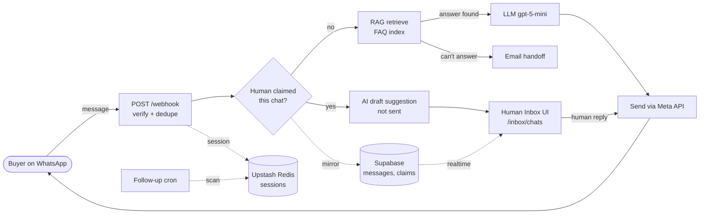

# Petrobind WhatsApp — Architecture

Live, clickable version: `/inbox/architecture` (log in at `/inbox/login` first).

**Goal:** the AI (RAG + LLM) answers FAQs; a human can see every message in real time and take over any chat.

## How it works
1. **Message in** — Meta posts to `/webhook` (`main.py`); signature verified, duplicates dropped.
2. **Who answers?** — if no operator holds the chat's claim, the AI replies. If one does, the AI stays silent and only offers a draft suggestion.
3. **RAG always runs** — retrieval happens on every message; if nothing relevant is found for a product question, the LLM is skipped and the team is emailed (zero-hallucination guardrail).
4. **Real-time inbox** — every buyer, AI and human message is mirrored to Supabase and pushed to `/inbox/chats` (Realtime, with an 8 s poll fallback).
5. **Human takeover** — Claim → type reply → sent through the same Meta send path. Release → the AI resumes.
6. **Follow-ups** — a scheduled job re-engages idle chats within buyer-local quiet hours; outside the 24 h window only approved templates are sent.

Supabase and Redis are optional/fire-and-forget: if either is down, WhatsApp replies still work.
